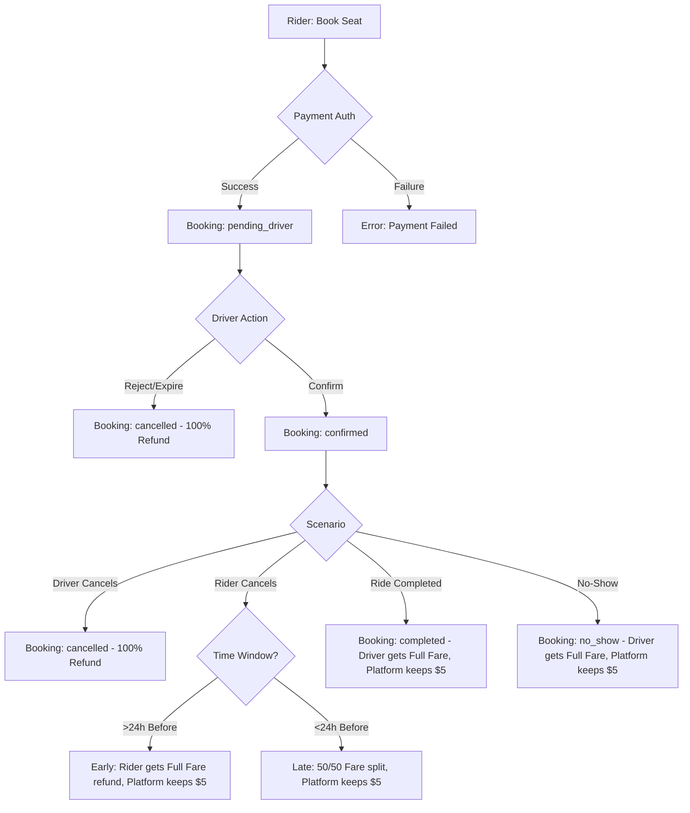

# Ride Lifecycle & Payment Documentation

This document outlines the end-to-end flow of a ride in CarpoolConnect, from the initial booking request to final driver payout or cancellation refund.

---

## 1. Flow Overview

### Visual Flow (Mermaid)
*If you cannot see the diagram below, please see the Text-based Diagram in the next section.*



### Text-based Diagram (Fallback)

```text
[ START: RIDER BOOKS SEAT ]
           |
           v
 [ PAYMENT AUTHORIZATION ] ----(Fail)---> [ ERROR: PAYMENT FAILED ]
           | (Success)
           v
 [ STATUS: PENDING_DRIVER ]
           |
           v
  { DRIVER ACTION? }
    |          |
 (Reject)   (Confirm)
    |          |
    v          v
[CANCELLED] [ STATUS: CONFIRMED ]
(100% Ref)     |
               |----( Driver Cancels )-----> [ 100% REFUND ]
               |
               |----( Rider Cancels >24h )--> [ FULL FARE REFUND, $5 FEE KEPT ]
               |
               |----( Rider Cancels <24h )--> [ 50% REFUND, 50% TO DRIVER, $5 FEE KEPT ]
               |
               |----( Ride Completed )------> [ FULL FARE TO DRIVER, $5 FEE KEPT ]
               |
               '----( Marked No-Show )------> [ FULL FARE TO DRIVER, $5 FEE KEPT ]
```


---

## 2. Step-by-Step Logic

### A. Booking & Authorization
When a rider requests a seat:
1.  **Pricing Calculation**:
    *   `Subtotal` = `PricePerSeat` × `Seats`
    *   `Platform Fee` = `$5.00` (Flat)
    *   **`Total Amount`** = `Subtotal` + `$5.00`
2.  **Stripe Authorization**:
    *   Stripe creates a **PaymentIntent** with `capture_method: manual`.
    *   This places a **hold** (authorization) on the rider's card for the `Total Amount`.
    *   *No money has left the account yet.*
3.  **Booking State**: Created as `pending_driver`.

### B. Driver Confirmation
*   **Confirmed**: If the driver accepts, status changes to `confirmed`. The hold remains.
*   **Rejected/Expired**: If the driver rejects (or doesn't act in time), the hold is **cancelled** (released) and the rider is not charged.

### C. Ride Completion & Capture
When the ride is finished:
1.  **Driver Action**: Taps "Complete Ride".
2.  **Stripe Capture**:
    *   `completeRideAndCharge` Cloud Function is called.
    *   The authorized PaymentIntent is **captured**.
    *   Funds are moved from rider's account to the platform's Stripe account.
3.  **Status**: Booking becomes `completed`, PaymentStatus becomes `paid`.

### D. Driver Payout
*   Drivers see their "Pending Payouts" in the app.
*   When they request a payout, the `processDriverPayout` function is called.
*   **Formula**: `Driver Earnings` = `Total Amount` - `$5.00 Platform Fee`.
*   Stripe performs a **Transfer** to the driver's connected bank account.

---

## 3. Cancellation Policy (New)

The logic depends on **when** the cancellation happens relative to the departure time.

| Scenario | Definition | Rider Refund | Driver Gets | Platform Gets |
| :--- | :--- | :--- | :--- | :--- |
| **Early Cancellation** | > 24h before departure | Full Fare (Total - $5) | $0 | $5.00 |
| **Late Cancellation** | < 24h before departure | 50% of Fare | 50% of Fare | $5.00 |
| **No-Show** | Marked by driver | $0 | Full Fare (100%) | $5.00 |
| **Driver Cancels** | Any time | **Full Refund ($20)** | $0 | $0 |

### Mathematical Breakdown (Example: $20 Total Booking)
*Assuming $15 Fare + $5 Platform Fee*

1.  **Early (>24h)**:
    *   Rider loses $5 fee.
    *   **Rider Refund**: $15.00
    *   **Platform Receipt**: $5.00
2.  **Late (<24h)**:
    *   Platform takes $5 first. Remaining is $15.
    *   $15 is split 50/50.
    *   **Rider Refund**: $7.50
    *   **Driver Earnings**: $7.50
    *   **Platform Receipt**: $5.00
3.  **No-Show**:
    *   Platform takes $5.
    *   **Rider Refund**: $0.00
    *   **Driver Earnings**: $15.00
    *   **Platform Receipt**: $5.00
4.  **Driver Cancellation**:
    *   Rider is made whole.
    *   **Rider Refund**: $20.00
    *   **Platform Receipt**: $0.00

---

## 4. Edge Cases & Safety
*   **Authorization Expiry**: Stripe authorizations usually expire after 7 days. If the ride is scheduled far in advance, the app handles "re-authorization" or captures late.
*   **Minimum Ride Duration**: Rides cannot be marked "Completed" until at least 5 minutes after they were "Started" to prevent fraudulent usage.
*   **Double Cancellation**: Once cancelled (by either party), the other party cannot cancel again. Seats are immediately restored to the ride's `availableSeats` count.
