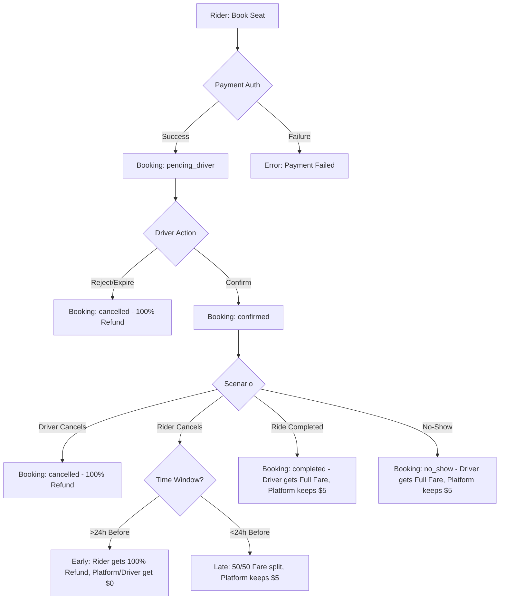

# Ride Lifecycle & Payment Documentation

This document outlines the end-to-end flow of a ride in CarpoolConnect, from the initial booking request to final driver payout or cancellation refund.

---

## 1. Flow Overview

### Visual Flow (Mermaid)
*If you cannot see the diagram below, please see the Text-based Diagram in the next section.*



### Text-based Diagram (Fallback)

```text
[ START: RIDER BOOKS SEAT ]
           |
           v
 [ PAYMENT AUTHORIZATION ] ----(Fail)---> [ ERROR: PAYMENT FAILED ]
           | (Success)
           v
 [ STATUS: PENDING_DRIVER ]
           |
           v
  { DRIVER ACTION? }
    |          |
 (Reject)   (Confirm)
    |          |
    v          v
[CANCELLED] [ STATUS: CONFIRMED ]
(100% Ref)     |
               |----( Driver Cancels )-----> [ 100% REFUND ]
               |
               |----( Rider Cancels >24h )--> [ 100% REFUND ]
               |
               |----( Rider Cancels <24h )--> [ 50% REFUND, 50% TO DRIVER, $5 FEE KEPT ]
               |
               |----( Ride Completed )------> [ FULL FARE TO DRIVER, $5 FEE KEPT ]
               |
               '----( Marked No-Show )------> [ FULL FARE TO DRIVER, $5 FEE KEPT ]
```


---

## 2. Step-by-Step Logic

### A. Booking & Authorization
When a rider requests a seat:
1.  **Pricing Calculation**:
    *   `Subtotal` = `PricePerSeat` × `Seats`
    *   `Platform Fee` = `$5.00` (Flat)
    *   **`Total Amount`** = `Subtotal` + `$5.00`
2.  **Stripe Authorization**:
    *   Stripe creates a **PaymentIntent** with `capture_method: manual`.
    *   This places a **hold** (authorization) on the rider's card for the `Total Amount`.
    *   *No money has left the account yet.*
3.  **Booking State**: Created as `pending_driver`.

### B. Driver Confirmation
*   **Confirmed**: If the driver accepts, status changes to `confirmed`. The hold remains.
*   **Rejected/Expired**: If the driver rejects (or doesn't act in time), the hold is **cancelled** (released) and the rider is not charged.

### C. Ride Completion & Capture
When the ride is finished:
1.  **Driver Action**: Taps "Complete Ride".
2.  **Stripe Capture**:
    *   `completeRideAndCharge` Cloud Function is called.
    *   The authorized PaymentIntent is **captured**.
    *   Funds are moved from rider's account to the platform's Stripe account.
3.  **Status**: Booking becomes `completed`, PaymentStatus becomes `paid`.

### D. Driver Payout
*   Drivers see their "Pending Payouts" in the app.
*   When they request a payout, the `processDriverPayout` function is called.
*   **Formula**: `Driver Earnings` = `Total Amount` - `$5.00 Platform Fee`.
*   Stripe performs a **Transfer** to the driver's connected bank account.

---

## 3. Cancellation Policy (New)

The logic depends on **when** the cancellation happens relative to the departure time.

| Scenario | Definition | Rider Refund | Driver Gets | Platform Gets |
| :--- | :--- | :--- | :--- | :--- |
| **Early Cancellation** | > 24h before departure | 100% Refund (Total) | $0 | $0 |
| **Late Cancellation** | < 24h before departure | 50% of Fare | 50% of Fare | $5.00 |
| **No-Show** | Marked by driver | $0 | Full Fare (100%) | $5.00 |
| **Driver Cancels** | Any time | **100% Refund (Total)** | $0 | $0 |

### Mathematical Breakdown (Example: $20 Total Booking)
*Assuming $15 Fare + $5 Platform Fee*

1.  **Early (>24h)**:
    *   **Rider Refund**: $20.00 (100%)
    *   **Platform Receipt**: $0.00
    *   **Driver Earnings**: $0.00
2.  **Late (<24h)**:
    *   Platform takes $5 first. Remaining is $15.
    *   $15 is split 50/50.
    *   **Rider Refund**: $7.50
    *   **Driver Earnings**: $7.50
    *   **Platform Receipt**: $5.00
3.  **No-Show**:
    *   Platform takes $5.
    *   **Rider Refund**: $0.00
    *   **Driver Earnings**: $15.00
    *   **Platform Receipt**: $5.00
4.  **Driver Cancellation**:
    *   Rider is made whole.
    *   **Rider Refund**: $20.00
    *   **Platform Receipt**: $0.00

---

## 4. Edge Cases & Robustness

### Currently Implemented ✅

| Scenario | Handling |
|---|---|
| **Authorization Expiry (7 days)** | If a ride is scheduled >7 days out and the authorization expires, `completeRideAndCharge` automatically attempts **re-authorization** using the rider's saved payment method. |
| **Missing PaymentIntent** | If a booking reaches completion without a payment intent, it's marked `payment_failed` with `missing_authorization`. Admin and rider are notified. |
| **Minimum Ride Duration** | Rides cannot be completed until at least **5 minutes** after they were started to prevent fraudulent instant completions. |
| **Re-Authorization Failure** | If re-authorization fails (e.g., card declined), the booking is marked `payment_failed` and the rider is notified to retry. |
| **Payment Retry (Manual)** | Riders with failed payments can tap "Retry Payment" in the app. The `retryPaymentForCompletedRide` function handles this. |
| **Payment Retry (Scheduled)** | A scheduled function (`retryFailedPaymentAuthorizations`) runs hourly to automatically retry failed authorizations (up to 3 attempts). |
| **Outstanding Balance Block** | Riders with unpaid balances from previous rides are blocked from booking new rides until they settle their account. |
| **Double Cancellation Prevention** | Once a booking is cancelled, the status is locked. Seats are immediately restored to `availableSeats`. |
| **Seat Restoration on Rejection** | If a driver rejects a `pending_driver` booking, seats are restored and the hold is released. |
| **Idempotency Keys** | All Stripe API calls use idempotency keys to prevent duplicate charges/refunds during network retries. |

### Recommendations for Future Enhancements ⚠️

| Scenario | Status | Notes |
|---|---|---|
| **Stripe Disputes (Chargebacks)** | ✅ Implemented | Webhook handlers for `charge.dispute.created` and `charge.dispute.closed` added. Blocks payouts and notifies admin/driver. |
| **Partial Seat Cancellation** | ✅ Implemented | `reduceBookingSeats` function allows riders to reduce seat count with prorated refund. |
| **Driver No-Show Verification** | ⚠️ Deferred | Requires UI design decisions (photo upload/GPS). Recommend discussing requirements first. |
| **Stale Payout Prevention** | 🔜 Todo | Add scheduled job to alert admin if payout not processed within X days. |
| **Fraud Scoring** | 🔜 Todo | Track cancellation/no-show/payment failure rates per user. |
| **Capture Deadline Warning** | 🔜 Todo | Warn drivers approaching 7-day auth expiry. |

---

## 5. Status Reference

| Booking Status | Description |
|---|---|
| `pending_driver` | Awaiting driver confirmation. Hold placed. |
| `confirmed` | Driver accepted. Hold active. |
| `completed` | Ride finished. Payment captured. |
| `cancelled` | Cancelled by rider or driver. |
| `no_show` | Passenger didn't show up. Full charge. |
| `payment_failed` | Payment capture or authorization failed. |

| Payment Status | Description |
|---|---|
| `authorized` | Hold placed, awaiting capture. |
| `captured` / `paid` | Payment successfully charged. |
| `refunded` | Partial or full refund issued. |
| `cancelled` | Authorization was released. |
| `authorization_expired` | Hold expired before capture. |
| `capture_failed` | Capture attempt failed. |
| `missing_authorization` | No PaymentIntent found at completion. |

